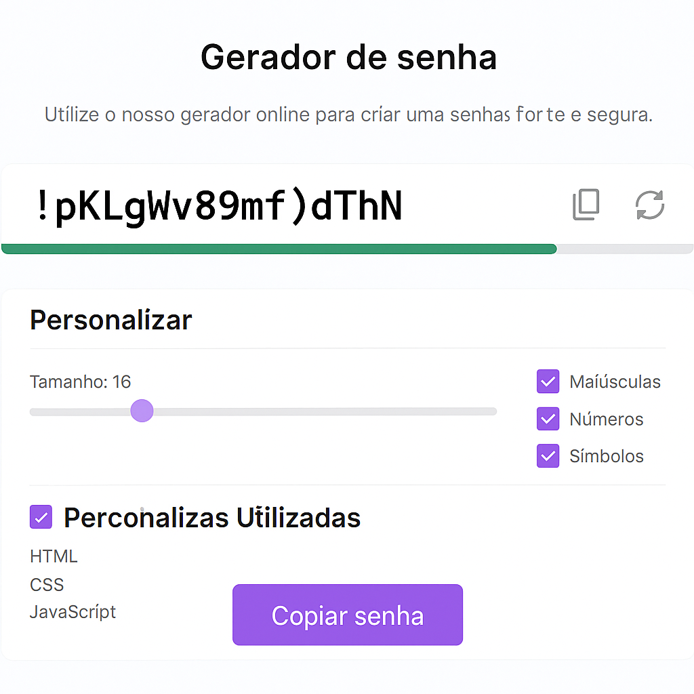

# 🔐 Gerador de Senhas

Este é um projeto de **Gerador de Senhas** que cria senhas seguras e personalizadas com diferentes combinações de letras maiúsculas, minúsculas, números e símbolos.



## 🚀 Funcionalidades

- Geração de senhas seguras;
- Definição de tamanho da senha com controle deslizante;
- Opções para incluir:
  - Letras maiúsculas;
  - Números;
  - Símbolos;
- Botão para copiar a senha gerada com um clique.

## 🛠️ Tecnologias Utilizadas

- HTML
- CSS
- JavaScript

🔗 Link do projeto [Acesse aqui o Gerador de senha online](https://eloaguilgel.github.io/Gerador-de-senhas/)


✨ Objetivo Este projeto foi desenvolvido com fins educacionais, para treinar habilidades em JavaScript e lógica de programação.

## 💡 Como usar

1. Clone o repositório:
   ```bash
   git clone https://github.com/EloaGuilgel/Gerador-de-senhas-.git

📝 Licença
Este projeto está sob a licença MIT. Sinta-se livre para usar, modificar e compartilhar!